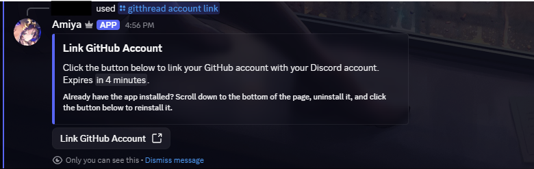
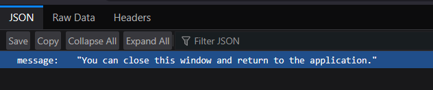

<Callout>Ensure you have the **Manage Server** permission on the server where you want to install the bot.</Callout>

## Invite the Bot

Click [here](https://discord.com/oauth2/authorize?client_id=411729784247156737) to invite the bot to your server.

## Linking Your GitHub Account

Before you can use Amiya, you need to link your GitHub account. To do this, use the `/gitthread account link` command. Click on the link provided and follow the instructions to authorize Amiya to access your GitHub account.

After installing the GitHub app, you will be redirected to a different page. If you see a message along the lines of "You can close this window and return to the application," you can safely close the page and return to Discord.

<Callout>
  After linking your account, you can use the `/gitthread account status` command to verify that your GitHub account is
  properly connected to Amiya.
</Callout>

