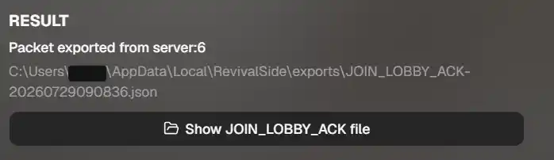
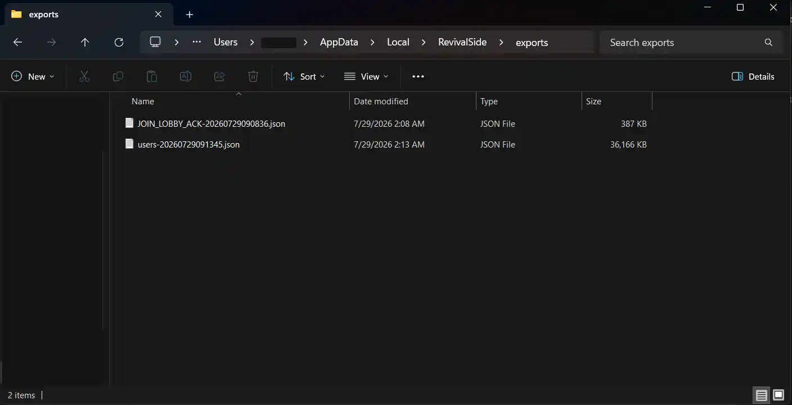
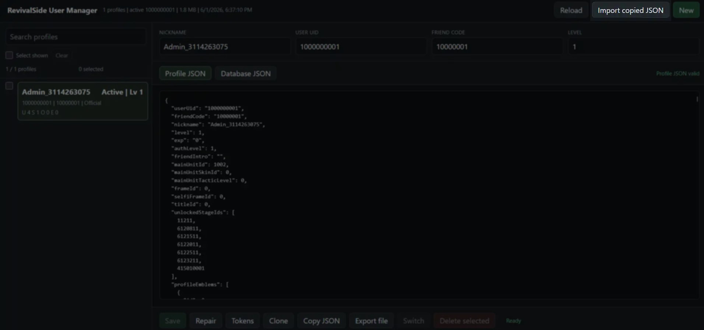

This guide will walk you through the process of importing your account data to RevivalSide. You can import data using one of two methods:

- [From Official Servers](#import-data-from-official-servers) - captures login packets from the official servers.
- [From JSON](#import-data-from-json) - import an existing JSON file.

## Import Data from Official Servers

In order to import your account data, we need to capture packets from the official servers and extract the information from it. To do this, we will use the "Cross Save" feature in the RevivalSide launcher.

<Steps>
<Step>

### Capturing Packets

<Callout type="warn">
Ensure you have CounterSide closed before starting the packet capture process.
</Callout>

Head over to the "Cross Save" tab in the RevivalSide launcher and click on the "Start Capture" button. This will start listening for CounterSide related packets.

</Step>
<Step>

### Login to Counterside

Once you have started listening for packets, login to the offical CounterSide servers. RevivalSide will automatically capture the necessary packets.

</Step>
<Step>

### Import Profile

After logging in, head back to the RevivalSide launcher, press "Finish and Export". If it was successful, you should see a `JOIN_LOBBY_ACK-XXXXXXXX.json` file in folder that was opened. Alternatively, you can check the "RESULT" section for the following:

After you have confirmed that the capture was successful, click on the "Import Captured Profile" button and wait for the import to finish. If it was successful, you should see a `users-XXXXXXXX.json` file in the same folder.

</Step>
<Step>

### (Optional) Verify Imported Data

If you want to verify that your data was imported correctly, you can launch the [User Manager](../../references/user-manager).

</Step>
</Steps>

## Import Data from JSON

If you have a JSON file containing account data, you can import it directly into RevivalSide. This is useful if you want to revert to a backup or use someone else's data.

<Steps>
<Step>

### Open User Manager

Open the [User Manager](../../references/user-manager) by clicking on the "User Manager" button in the launcher. This will allow you to view and manage account data on RevivalSide.

</Step>
<Step>

### Import JSON File

Click on the "Import JSON" button on the top right of the User Manager. This will open a file dialog where you can select the JSON file containing the account data you want to import.

</Step>
</Steps>

## Troubleshooting

### No JOIN_LOBBY_ACK packet was found

<Callout>
  This is error can be caused by a number of issues. If you have a solution that
  isn't listed here, please let us know.
</Callout>

If you are getting the error "No JOIN_LOBBY_ACK packet was found...", it means that RevivalSide was unable to capture or parse the necessary packets from the official servers.

In order to fix this, you can try the following:

- Disable your VPN
- Disable your firewall
