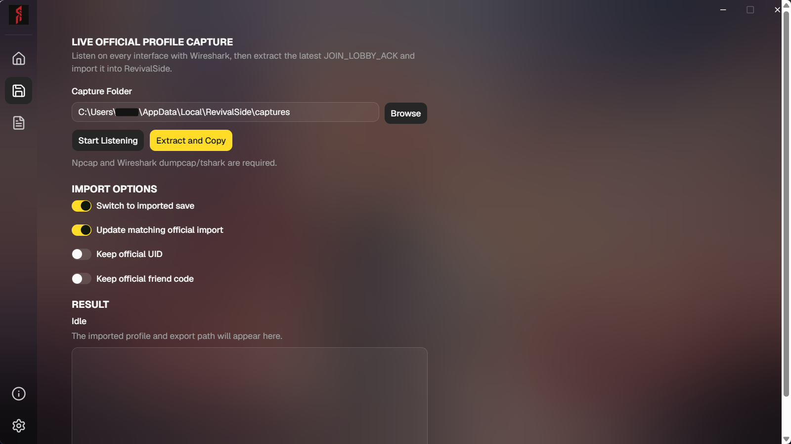
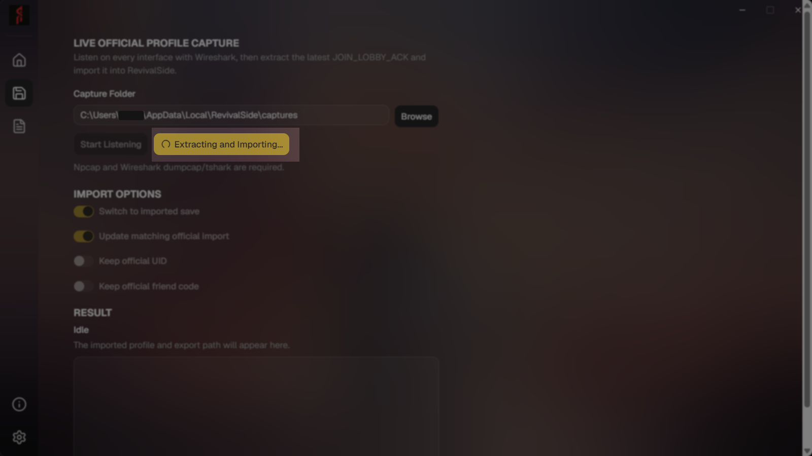
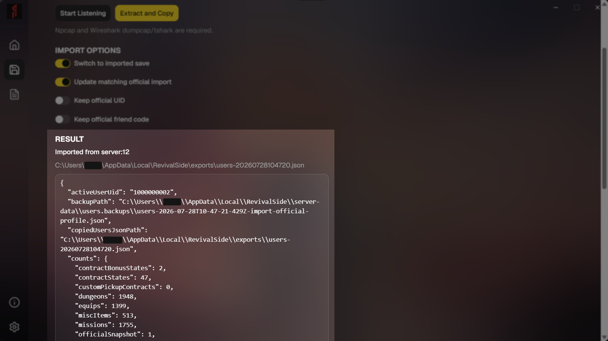
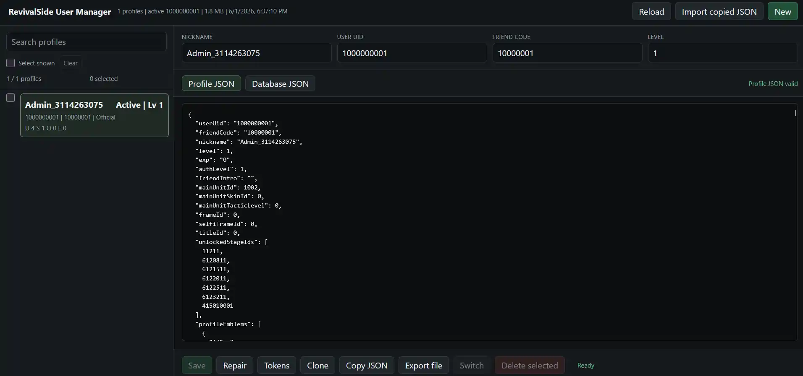

This guide will walk you through the process of importing your account data to RevivalSide. You can import your account data in two ways:

- [From Official Servers](#import-data-from-official-servers)
- [From JSON](#import-data-from-json)

## Import Data from Official Servers

<Steps>
<Step>

### Capturing Packets

<Callout type="warn">
Ensure you have CounterSide closed before starting the packet capture process.
</Callout>

In order to import your account data, we need to capture packets from the official servers. To do this, head over to the "Cross Save" tab in the RevivalSide launcher and click on the "Start Listening" button. This will start listening for CounterSide related packets.

</Step>
<Step>

### Login to the Official Servers

Once you have started listening for packets, login to the offical CounterSide servers. RevivalSide will automatically capture the necessary packets.

</Step>
<Step>

### Extract and Copy Account Data

After logging in, head back to the "Cross Save" tab in the RevivalSide launcher, press "Stop Listening", and click on the "Extract and Copy" button next to it. RevivalSide now try to extract your account data from the captured packets.

You can check whether the extraction was successful by checking the "RESULT" section on the bottom of the "Cross Save" tab. If it was successful, you should see something similar to the following:

</Step>
<Step>

### Launch User Manager

After importing your account data, you can launch the [User Manager](./saving-account-data.mdx#user-manager) to ensure your data was imported correctly.

</Step>
</Steps>

## Import Data from JSON

<Steps>
<Step>

### Open User Manager

Open the [User Manager](./saving-account-data.mdx#user-manager) by clicking on the "User Manager" button in the launcher. This will allow you to view and manage account data on RevivalSide.

</Step>
<Step>

### Import JSON File

Click on the "Import JSON" button on the top right of the User Manager. This will open a file dialog where you can select your JSON file containing your account data.

</Step>
</Steps>

## Troubleshooting

### No JOIN_LOBBY_ACK packet was found

<Callout>
  This is error can be caused by a number of issues. If you have a solution that
  isn't listed here, please let us know.
</Callout>

If you are getting the error "No JOIN_LOBBY_ACK packet was found...", it means that RevivalSide was unable to capture or parse the necessary packets from the official servers.

In order to fix this, you can try the following:

- Disable your VPN
- Disable your firewall
