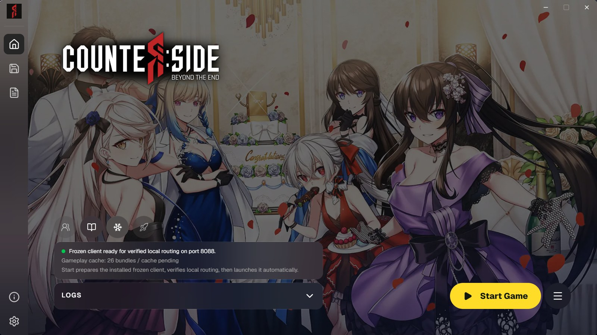

Now that you have RevivalSide installed, you can start the server to begin using it. Navigate to the "Home" tab in the launcher to find the options for starting and stopping the server.

## Starting the server

<Callout>
  When setting up RevivalSide for the first time, you will need to wait a while for the server to extract and set up the
  necessary files. This may take a few minutes, so please be patient.
</Callout>

To start the server, simply click on the "Start Game" button on the bottom right. This will start the RevivalSide server and CounterSide client.

## Stopping the server

To stop the server, simply click on the "Stop Server" button on the bottom right. This will stop the RevivalSide server and close CounterSide.