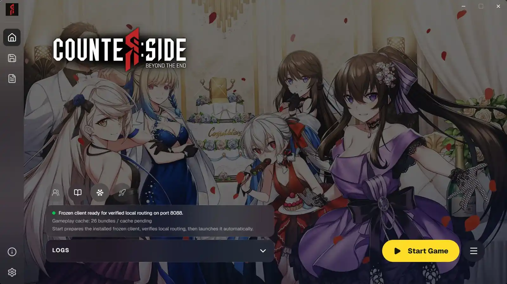

Assuming you have following the [installation guide](../../setup/installation.mdx), navigate to the "Home" tab in the launcher to find the options for starting and stopping the server.

## Starting the server

Click the "Start Game" button on the bottom right to start the server. This will start the RevivalSide server and open the frozen CounterSide client.

<Callout>
  When starting for the first time, it may take several minutes to extract and set up the necessary files.
</Callout>

## Stopping the server

To stop the server, simply click on the "Stop Server" button.