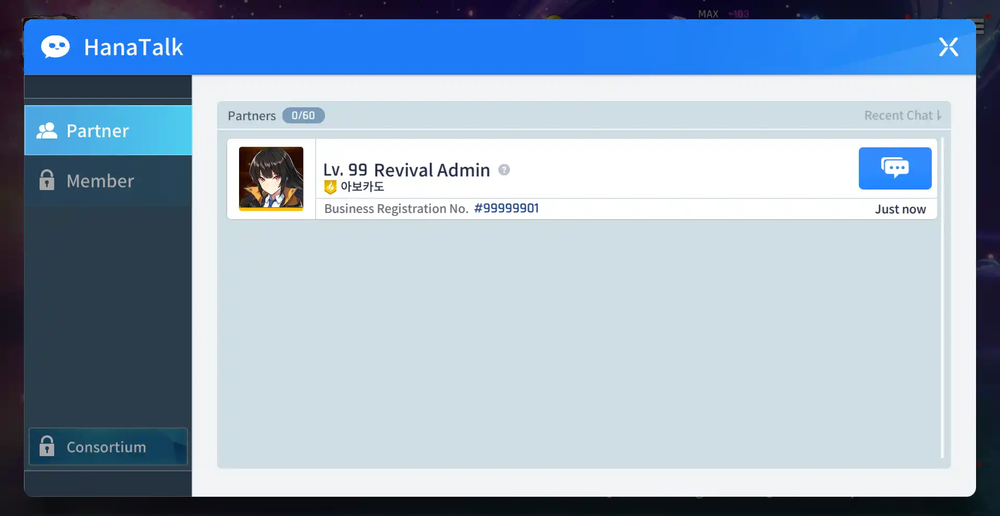
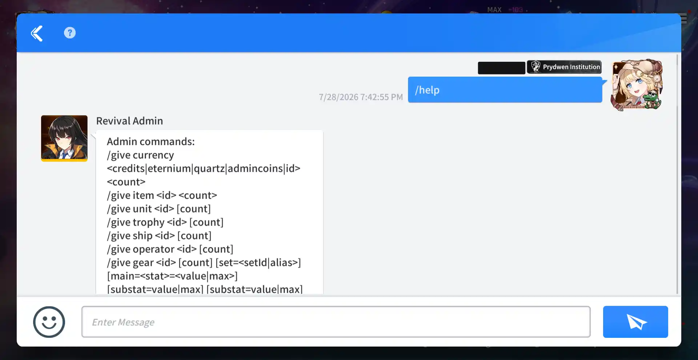

<Callout>
This feature is locked until you clear Episode 1 of the main story as it requires HanaTalk to be unlocked.
</Callout>

RevivalSide has a built-in admin commands that allows you to manage the server and give yourself items and units.

## Opening the Admin Chat

<Steps>
<Step>

### Open HanaTalk

In the game's main menu, click on the "HanaTalk" button to open the chat window.

</Step>
<Step>

### Open "RevivalSide Admin" Chat

Once HanaTalk is open, click on the message icon next to "Revival Admin" so that you can send messages to the console.

</Step>
</Steps>

## Using Commands

In order to use the admin commands, you will need to type them into the chat box in HanaTalk. If you are unsure of what commands are available, you can type `/help` to see a list of all the commands and the parameters they require.

### Parameters

Some commands require parameters in order to work. Parameters are additional information that you provide to the command in order to specify what you want it to do. For example, the `/give currency` command requires a parameter for the type of currency (`<credits|eternium|quartz|admincoins|id>`) and the amount you want to give (`<amount>`).

Unfortunately, the parameters listed in the `/help` command do not follow a consistent format, but they are the same. For example, with the `/give` command, `<count>` and `[count]` both mean the same thing, which is the amount of the item you want to give. The same goes for `<type|type2>` and `type|type2`, which both mean the type of item you want to give.

### Examples

- `/give currency credits 1000` - Gives you 1000 credits.
- `/give skin 104206` - Gives you the skin with the ID of 104206.
- `/clear` - Clears your mail/inbox.

## Tips

- Use the RevivalSide wiki to look up IDs for units, items, gear, skins, and more.
- Make backups of your save before running any risky command such as `/give all`!
