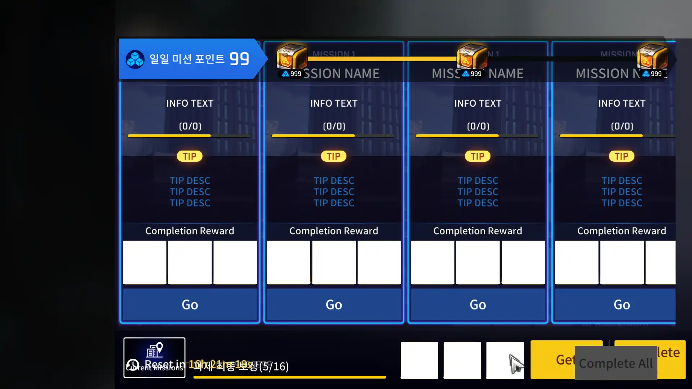
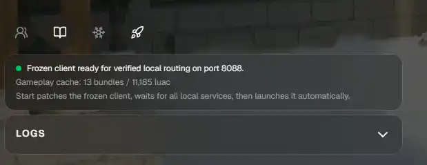
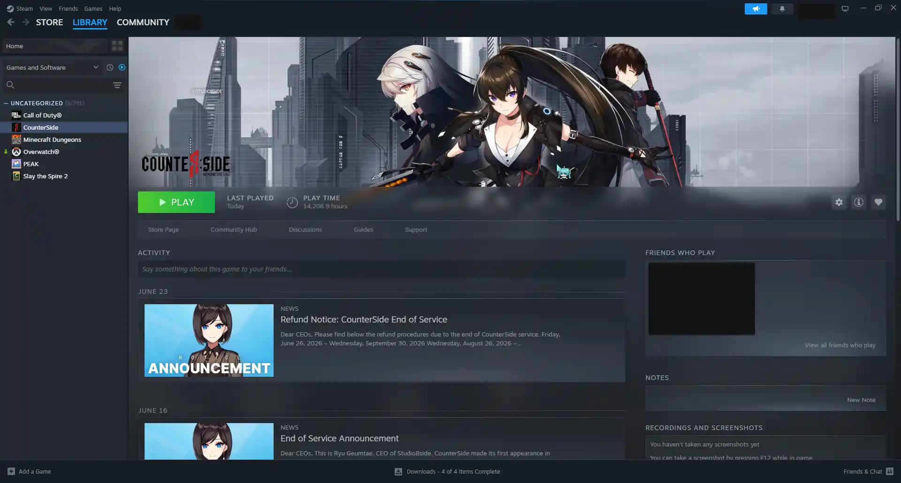

### Missing Files

When [freezing the client](../setup/installation#freeze-the-counterside-client), it is possible that some files were not copied correctly. If this happens, you may see ui and other assets missing as shown below:

In order to fix this, copy the missing files from the `CounterSide` folder into RevivalSide's `frozen-client\CounterSide-XXX` folder.

<Steps>
<Step>

#### Find CounterSide on Steam

Open Steam and find CounterSide in your library.

</Step>
<Step>

#### Browse CounterSide's Local Files

Open CounterSide's properties by clicking on the gear icon and hover over the "Manage" option, then click on "Browse Local Files". This will open the folder where CounterSide is installed.

</Step>
<Step>

#### Open RevivalSide's Frozen Client Folder

<Callout>The default installation path is `%localappdata%\RevivalSide`.</Callout>

Open RevivalSide's frozen client folder by finding your installation folder and opening `frozen-client\CounterSide-XXX`.

</Step>
<Step>

#### Copy Missing Files

The most common files that RevivalSide fails to copy are in `frozen-client\CounterSide-XXX\Assetbundles` folder, if you are missing any files from there, copy it from the `CounterSide\Assetbundles` folder. If you are missing other files, copy them as well.

</Step>
</Steps>
