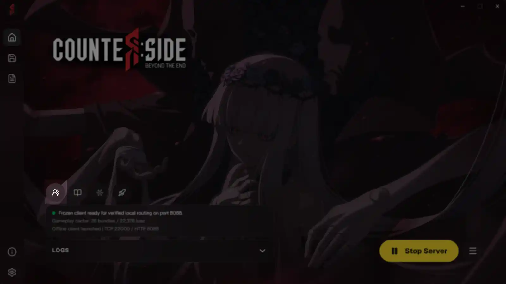

## Overview

The User Manager lets you manage saved accounts from the launcher. It allows you to view, export, and manage account data on RevivalSide.

## How to Use

<Callout>
  The server must be [running](./starting-and-connecting.mdx#starting-the-server) in order to use the User Manager.
</Callout>

You can open the User Manager by clicking on the "User Manager" button in the "Home" tab of the RevivalSide launcher. This will open a new window in your browser where you can view and manage your saved accounts.

