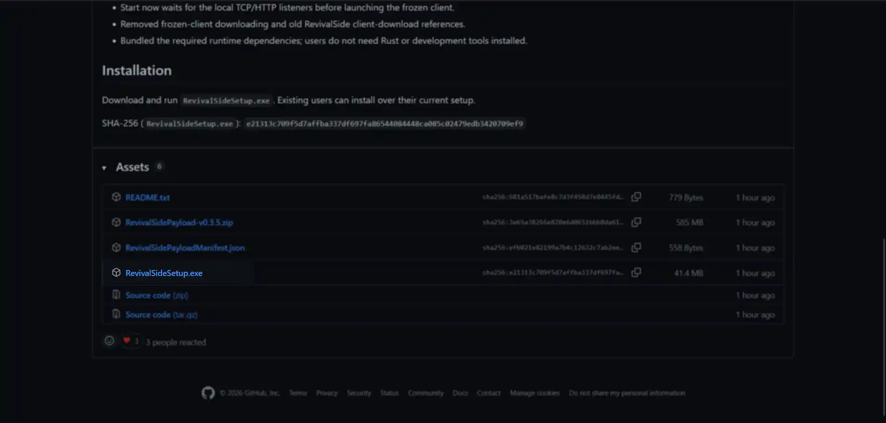
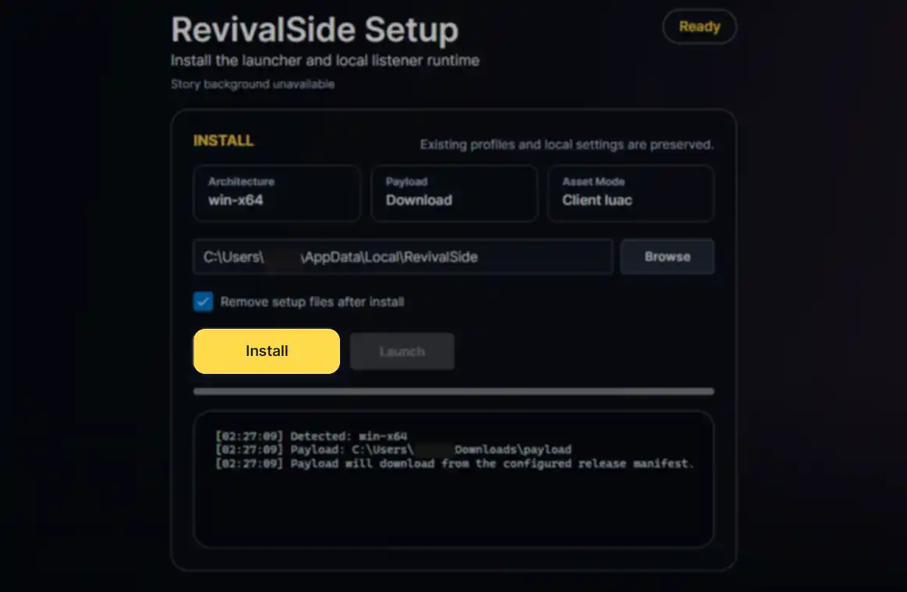
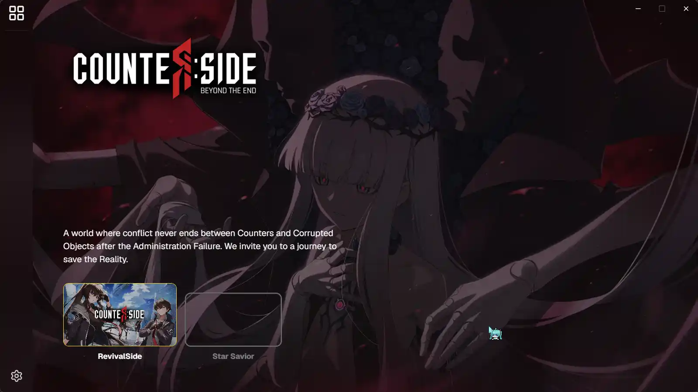
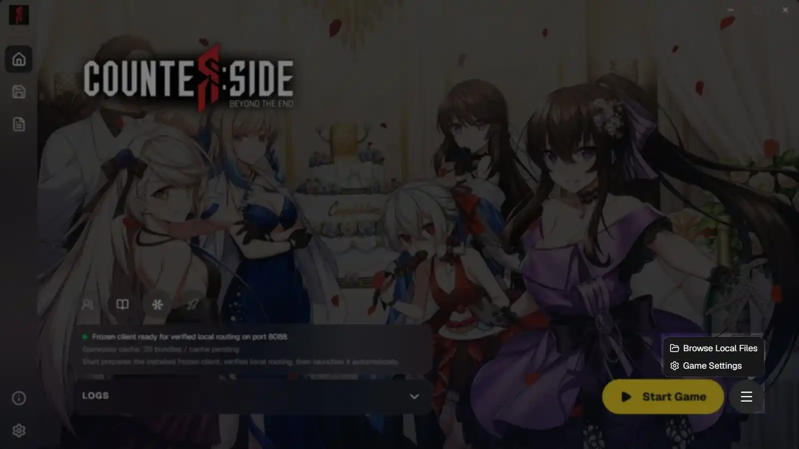
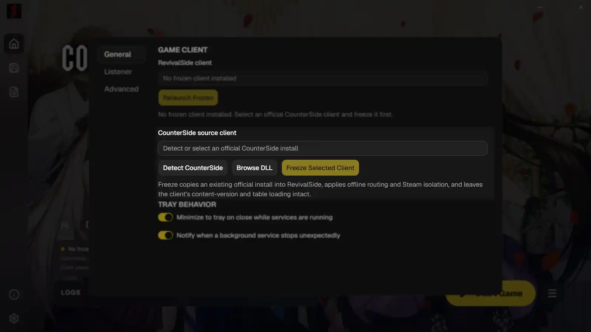
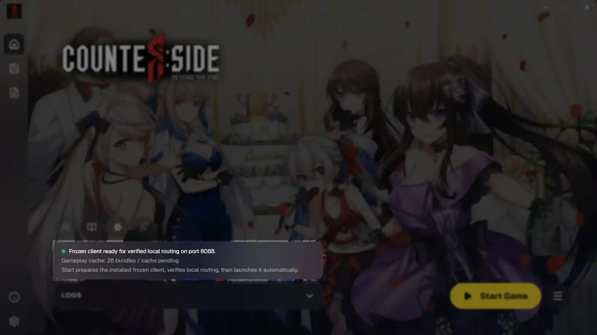
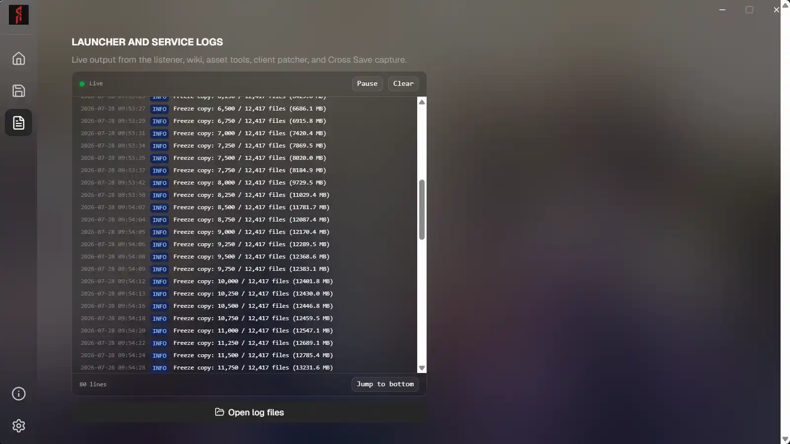

All downloads for RevivalSide are available on the [releases](https://github.com/MadlyMoe/RevivalSide/releases/latest) page on GitHub. Currently, the launcher is only available for Windows and Android. IOS is not supported at this time.

## Windows

<Callout>
  The default installation path is `%localappdata%\RevivalSide`.
</Callout>

<Steps>
<Step>

### Download RevivalSide

Download the `RevivalSideSetup.exe` file from the [releases](https://github.com/MadlyMoe/RevivalSide/releases/latest) page.

</Step>
<Step>

### Run the Installer

Run the executable file you just downloaded and follow the prompts to install RevivalSide. You can choose whether or not to customize the installation path. If you choose to customize the installation path, make sure to remember where you installed it as this guide uses the default installation path.

</Step>
<Step>

### Launch the Launcher

Once the installation is complete, it should automatically start the RevivalSide launcher. If it doesn't, you can press the "Launch" button next to "Install" or manually open the launcher from the installation path.

</Step>
<Step>

### Freeze the CounterSide Client

Before you can play CounterSide offline, you need to "freeze" the client. To do this, click the hamburger menu next to the "Start Game" button and click "Game Settings".

From here, find the "CounterSide source client" section and click the "Detect CounterSide" button. This will try to find CounterSide's `Assembly-CSharp.dll` file. If it cannot find it, please press "Browse DLL" and locate it manually.

<Callout>
This file is found in the `CounterSide\Data\Managed` folder of your CounterSide installation.
</Callout>

After the client has been detected, click the "Freeze Selected Client" button. Once it is complete, it should say "Frozen client ready for verified local..." in the "Home" tab of the launcher.

<Callout type="idea">
You can check the progress of "Freeze Selected Client" in the "Logs" tab of the launcher. This also applies to other processes such as starting the server and wiki.
</Callout>

</Step>
</Steps>